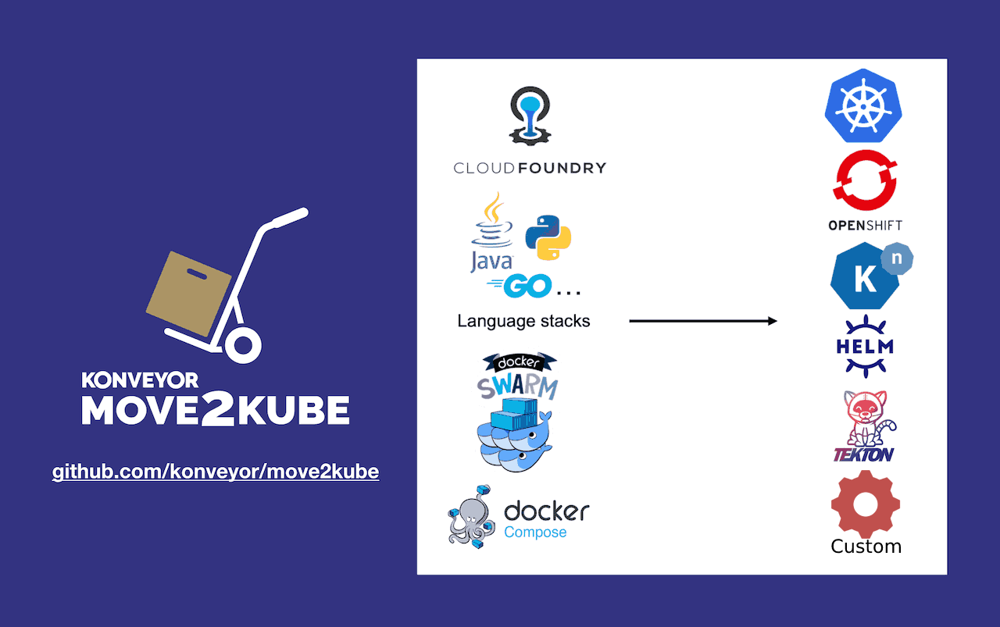

# Synopsis

This project is use to test the tools Konveyer Mo2Kube available at this [location](https://move2kube.konveyor.io/)

We are using Three types of applications :

* dotnet5webapp : is a simple dot web application with a simple rest API.
* nodejs : is a simple Nodejs application with a simple text displayed on the web front.
* simple-rest-api: is a simple Java rest API aplication.